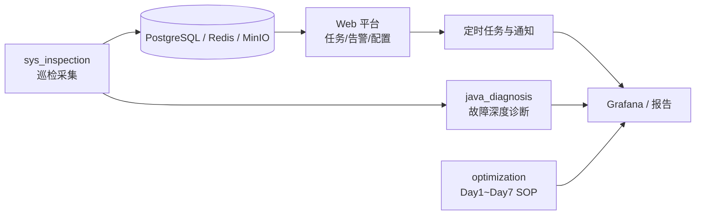
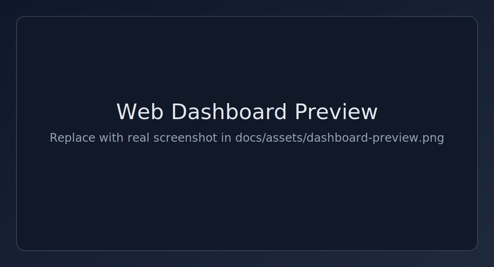
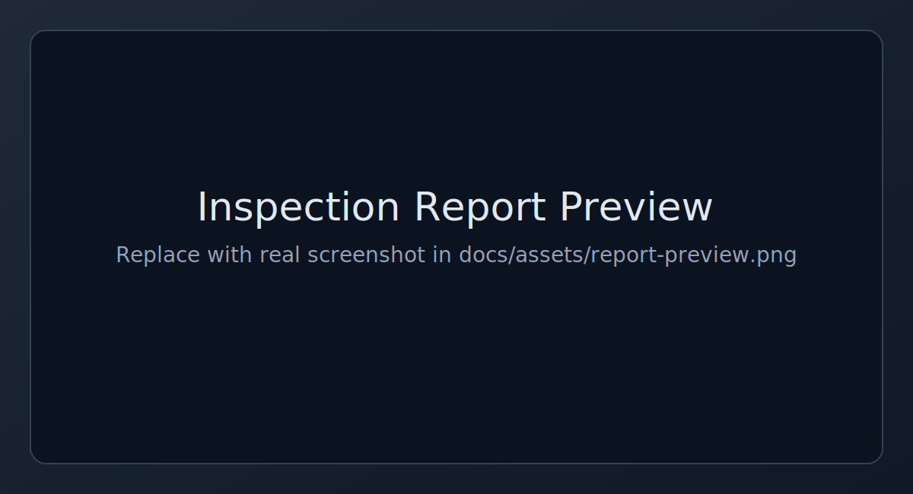

# 🛠️ systemcheck 运维巡检与优化工具集

<div align="center">


</div>

> 一个聚焦 **系统巡检、故障诊断、生产优化** 的实践仓库，覆盖从“发现问题”到“闭环治理”的完整链路。  
> 适合运维同学在日常值班、应急排障、优化接管场景中快速落地。

📄 English: [`README_EN.md`](README_EN.md)

---

## 📖 目录

- [✨ 项目亮点](#highlights)
- [🎯 适用场景](#scenarios)
- [🏗️ 总体架构](#architecture)
- [📸 界面预览](#preview)
- [📦 模块说明](#modules)
- [🚀 快速开始](#quickstart)
- [⚡ 常用命令速查](#cheatsheet)
- [🧱 环境与依赖](#env)
- [🗂️ 仓库结构](#structure)
- [📚 文档地图](#docs)
- [🧭 推荐工作流](#workflow)
- [🛡️ 注意事项](#notes)
- [🤝 贡献说明](#contribute)

---

## <a id="highlights"></a>✨ 项目亮点

- 🔍 **巡检自动化**：批量 SSH 巡检，支持 HTML / Text / JSON 报告
- 🧠 **诊断智能化**：Java 高 CPU 自动定位热点线程并关联堆栈
- 📈 **治理体系化**：Day1~Day7 生产优化 SOP + 配套脚本
- 🔔 **闭环运营化**：Web 管理、定时任务、告警通知、可视化看板

---

## <a id="scenarios"></a>🎯 适用场景

- 值班巡检：每天批量检查主机状态，快速输出可阅读报告
- 紧急排障：Java CPU 飙高时一键抓取线程与 GC 关键证据
- 稳定性治理：接管新环境后按 Day1~Day7 逐步建立基线
- 运营闭环：通过 Web + 告警 + 看板做持续化运维管理

---

## <a id="architecture"></a>🏗️ 总体架构



---

## <a id="preview"></a>📸 界面预览

<div align="center">
  
  
</div>

> 你可以把真实截图放到 `docs/assets/`，并替换这里的图片链接。  
> 已提供占位图，详情见 [`docs/assets/README.md`](docs/assets/README.md)。

---

## <a id="modules"></a>📦 模块说明

| 模块 | 作用定位 | 关键能力 | 入口文档 |
|---|---|---|---|
| `sys_inspection/` | 服务器巡检平台 | Shell 批量巡检 + Web 管理平台 + 定时任务与告警通知 | [`sys_inspection/README.md`](sys_inspection/README.md) |
| `java_diagnosis/` | Java 高 CPU 故障排查 | 自动定位高 CPU 线程、关联 jstack、分析 GC/死锁并生成诊断报告 | [`java_diagnosis/README.md`](java_diagnosis/README.md) |
| `optimization/` | 生产优化 SOP 与落地脚本 | Day1~Day7 运维接管清单、SOP、审计/基线脚本 | [`optimization/docs/production-server-optimization-sop.md`](optimization/docs/production-server-optimization-sop.md) |

---

## <a id="quickstart"></a>🚀 快速开始

### 1) 服务器一键巡检（Shell / Web）

```bash
cd sys_inspection
bash inspect.sh --help
```

如需启动 Web 平台（含 PostgreSQL / Redis / MinIO / Grafana）：

```bash
cd sys_inspection
cp .env.example .env
docker-compose up -d
```

### 2) Java 应用 CPU 异常诊断

```bash
cd java_diagnosis
bash java_cpu_diagnosis.sh -h
# 或直接自动诊断 CPU 最高的 Java 进程
bash java_cpu_diagnosis.sh
```

### 3) 生产优化 7 天推进

```bash
cd optimization/scripts
bash day1_audit.sh
bash day2_monitoring_verify.sh
# ...按 Day3 ~ Day7 逐步执行
```

---

## <a id="cheatsheet"></a>⚡ 常用命令速查

```bash
# 全量巡检并输出 HTML 报告
cd sys_inspection && bash inspect.sh -a -r html --inspector day_shift

# 指定主机巡检
cd sys_inspection && bash inspect.sh --host 192.168.1.10 --user root --password '******'

# Java CPU 自动诊断
cd java_diagnosis && bash java_cpu_diagnosis.sh

# Day1 只读体检
cd optimization/scripts && bash day1_audit.sh
```

---

## <a id="env"></a>🧱 环境与依赖

| 组件 | 说明 |
|---|---|
| 操作系统 | 主要面向 Linux 目标服务器 |
| Shell 工具 | `bash`、`ssh`、`awk`、`sed`、`ps`、`df`（按脚本场景可能需要 `sshpass` 等） |
| Web 依赖 | Docker / Docker Compose（推荐）或 Python 3.11+ 本地运行 |
| 数据组件 | PostgreSQL、Redis、MinIO（Web 模式） |

---

## <a id="structure"></a>🗂️ 仓库结构

```text
systemcheck/
├── sys_inspection/      # 巡检系统（Shell + Web）
├── java_diagnosis/      # Java CPU 诊断脚本
├── optimization/        # 生产优化 SOP 与脚本
├── docs/assets/         # README 预览图资源
└── fix_all_scripts.sh   # 批量修复脚本行尾（CRLF -> LF）
```

---

## <a id="docs"></a>📚 文档地图

- 巡检系统需求与设计：[`sys_inspection/服务器一键巡检系统需求文档.md`](sys_inspection/服务器一键巡检系统需求文档.md)
- Shell 巡检维护手册：[`sys_inspection/docs/第一阶段-Shell巡检脚本开发总结.md`](sys_inspection/docs/第一阶段-Shell巡检脚本开发总结.md)
- Web 平台开发总结：[`sys_inspection/docs/第二阶段-Web管理平台开发总结.md`](sys_inspection/docs/第二阶段-Web管理平台开发总结.md)
- 定时巡检与告警总结：[`sys_inspection/docs/第三阶段-定时巡检与告警通知开发总结.md`](sys_inspection/docs/第三阶段-定时巡检与告警通知开发总结.md)
- 生产优化总 SOP：[`optimization/docs/production-server-optimization-sop.md`](optimization/docs/production-server-optimization-sop.md)
- 执行前检查（Preflight）：[`optimization/docs/preflight-and-variables.md`](optimization/docs/preflight-and-variables.md)

---

## <a id="workflow"></a>🧭 推荐工作流

1. **先巡检**：通过 `sys_inspection` 快速发现风险主机与异常项。
2. **再诊断**：针对 Java CPU 异常，使用 `java_diagnosis` 深挖根因。
3. **后治理**：按 `optimization` 的 Day1~Day7 SOP 做系统化优化与演练。
4. **形成闭环**：结合 Web + 告警 + Grafana 持续运营。

---

## <a id="notes"></a>🛡️ 注意事项

- 涉及变更类操作前，建议先阅读：`optimization/docs/preflight-and-variables.md`。
- 若从 Windows 编辑脚本后出现换行符问题，可在仓库根目录执行：

```bash
bash fix_all_scripts.sh
```

---

## <a id="contribute"></a>🤝 贡献说明

欢迎提交改进建议与 PR，建议优先聚焦：

- 文档一致性（参数/字段/输出格式）
- 脚本兼容性（不同发行版差异）
- 可观测性与告警可靠性

提交前建议：

1. 先阅读对应子目录 README 和 docs
2. 保持 Shell 脚本可在 Linux 下执行
3. 变更文档与代码同步更新

---

<div align="center">

**祝你巡检顺利、告警更少、系统更稳 🎯**

</div>
